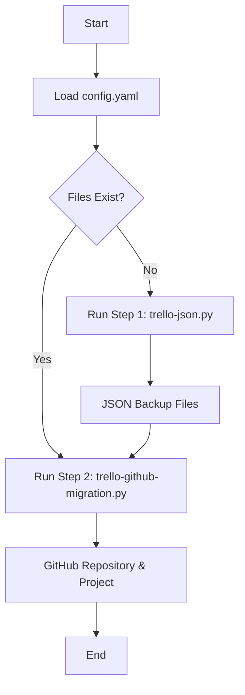
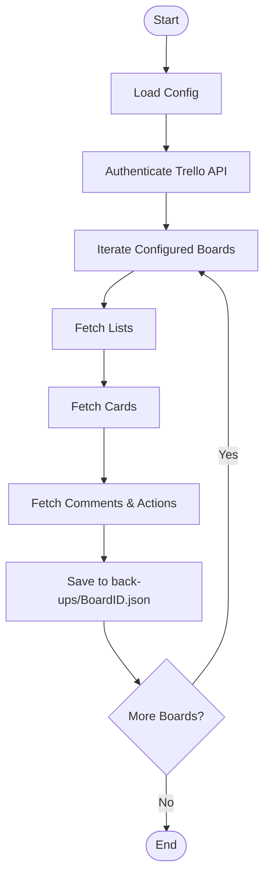
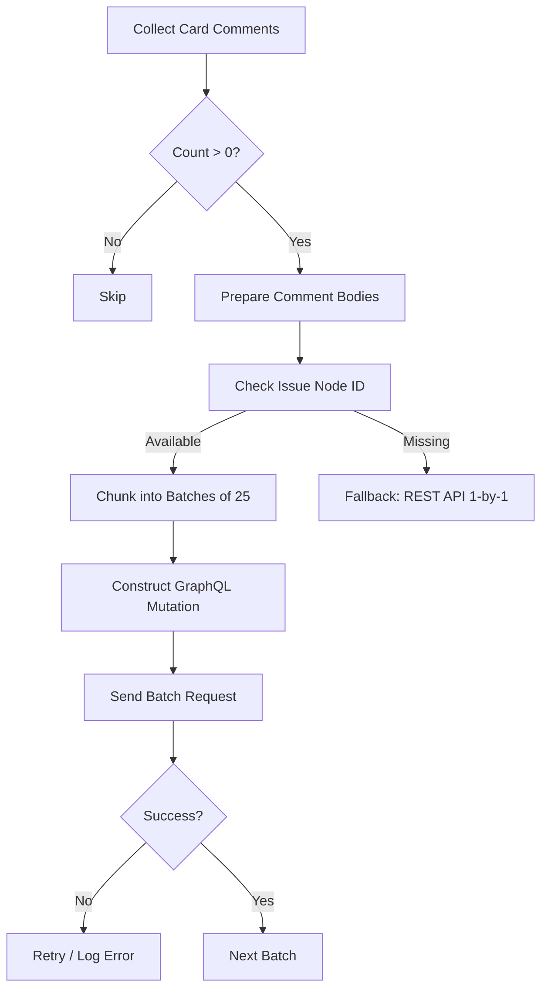

# Trello to GitHub Migration Tool

This tool facilitates the migration of Trello boards to GitHub Issues and Projects. It exports Trello data (cards, lists, comments) to local JSON backups and then recreates them on GitHub, preserving status columns and comments.

## 📋 Features

*   **Trello Export**: Backs up Cards, Lists, and Comments to JSON.
*   **Issue Creation**: Converts Trello cards to GitHub Issues.
*   **Comment Migration**: Migrates Trello comments to GitHub Issue comments (batching support for efficiency).
*   **Project Sync**: Maps Trello Lists to GitHub Project V2 Status columns.
*   **Timezone Adjustment**: Converts timestamps to Taiwan GMT+8.
*   **Rate Limit Handling**: Smart retries and GraphQL quota management.

## 🛠 Prerequisites

*   **Python 3.8+**
*   **Git**
*   **GitHub CLI (`gh`)**: Must be installed and authenticated.
    *   Install: [cli.github.com](https://cli.github.com/)
    *   Auth: `gh auth login` (Scopes required: `repo`, `read:org`, `project`, `read:project`)

## 🚀 Installation & Setup

Follow these steps to prepare the repository.

### 1. Clone the Repository

```bash
git clone https://github.com/bmw-ece-ntust/trello-github-migration.git
cd trello-github-migration
```

### 2. Set up Virtual Environment

Create a virtual environment with the custom prompt `(github-migration)`:

```bash
# Create venv
python3 -m venv .venv --prompt github-migration

# Activate venv
# On macOS/Linux:
source .venv/bin/activate

# On Windows:
# .venv\Scripts\activate
```

You should see `(github-migration)` in your terminal prompt.

### 3. Install Dependencies

```bash
pip install -r requirements.txt
```

### 4. Configuration

1.  Copy the example config:
    ```bash
    cp config.example.yaml config.yaml
    ```
2.  Edit `config.yaml` with your credentials:
    *   **Trello**: API Key and Token (Get from [trello.com/app-key](https://trello.com/app-key)).
    *   **GitHub**: Leave as `YOUR_GITHUB_TOKEN` to use the `gh` CLI auth (recommended).
    *   **Boards**: Define mapping between Trello Board IDs and GitHub Repo/Project URLs.

## 📦 Usage

You can run the full workflow via `main.py` or run steps individually.

### Option A: Automated Workflow

Edit `main.py` to target your specific board if needed, then run:

```bash
python main.py
```

### Option B: Manual Steps

#### Step 1: Create Backup (Trello Export)

This script downloads data from Trello and saves it to the `back-ups/` directory.

```bash
# Run backup
python trello-json.py

# Optional: Force refresh even if file exists
python trello-json.py --refresh
```

#### Step 2: Migrate to GitHub

This script reads the JSON backup and pushes data to GitHub.

```bash
# Migrate all configured boards
python trello-github-migration.py migrate

# Migrate specific board
python trello-github-migration.py migrate --board "internship"
```

## 🧩 Logic & Process Flow

### 1. High-Level Overview



### 2. Backup Process (`trello-json.py`)



### 3. Migration Process (`trello-github-migration.py`)

```mermaid
graph TD
    Start([Start]) --> AuthGH[Authenticate GitHub CLI];
    AuthGH --> CheckLimit[Check Rate Limits];
    CheckLimit --> LoadBackup[Read JSON Backup];
    LoadBackup --> SyncCols[Sync Project Columns];
    SyncCols --> LoopLists[Iterate Trello Lists];
    
    LoopLists --> LoopCards[Iterate Cards in List];
    LoopCards --> CheckExist{Issue Exists?};
    
    CheckExist -- Yes --> VerifyCom[Verify Comments];
    VerifyCom --> AddMissing[Add Missing Comments];
    
    CheckExist -- No --> CreateIssue[Create GitHub Issue];
    CreateIssue --> PostComments[Batch Post Comments (GraphQL)];
    PostComments --> AddProject[Add to Project];
    AddProject --> SetStatus[Set Status Column];
    
    SetStatus --> NextCard{More Cards?};
    AddMissing --> NextCard;
    
    NextCard -- Yes --> LoopCards;
    NextCard -- No --> NextList{More Lists?};
    NextList -- Yes --> LoopLists;
    NextList -- No --> End([End]);
```

### 4. Batch Comment Detail

To reduce API usage, comments are bundled into single GraphQL requests.



## ⚠️ Notes

*   **Rate Limits**: The script includes automatic sleeping when GraphQL rate limits are hit.
*   **Idempotency**: The script checks if issues already exist (by title) to avoid duplicates.
*   **Comments**: Comments are appended to the issue. If migrated multiple times, the script attempts to verify presence before adding.
