<h1 align="center">Project Documentation - Guideline</h1>

---

> [!WARNING]
>
> 1. Use this template as the `README.md` of your main research repository.
>
> 2. The [SOP template of project documentation](https://github.com/bmw-ece-ntust/SOP/blob/master/project-documentation.md) is regularly updated.
> Please check it regularly.

> [!CAUTION]
> **Confidentiality Notice:**
> Keep this document `private` by default.
>
> Publish only allowed after the paper of this project is accepted.
>
> **Note**: Request repository access from the GitHub admin.

---

> [!NOTE]
> **Documentation Structure:**
>
> - **Installation Guide**: System setup, configuration, and deployment procedures
> - **User Guide**: Operating instructions for the deployed system
> - **Project Documentation**: Technical architecture, use cases, MSC, flowcharts, and class diagrams with links to installation guides

## Purpose

This documentation describes the design, implementation, and verification workflow of the Trello-to-GitHub migration project. The goal is to make the migration process reproducible so co-authors and collaborators can validate exported data, migration logic, and resulting GitHub artifacts.

**Documentation Hierarchy:**

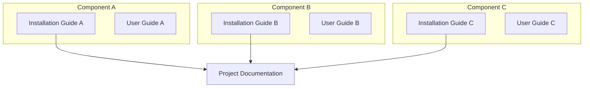
```mermaid
graph TD
    PD[Project Documentation]

    subgraph "Component A"
        IG-A[Installation Guide A]
        UG-A[User Guide A]
    end

    subgraph "Component B"
        IG-B[Installation Guide B]
        UG-B[User Guide B]
    end

    subgraph "Component C"
        IG-C[Installation Guide C]
        UG-C[User Guide C]
    end

    IG-A --> PD
    IG-B --> PD
    IG-C --> PD
```

## Table of Contents

> [!TIP]
> **Auto-Generate Table of Contents:**
> Use [Markdown All in One](https://marketplace.visualstudio.com/items?itemName=yzhang.markdown-all-in-one#table-of-contents) extension in VS Code for automatic TOC generation.

- [Purpose](#purpose)
- [Table of Contents](#table-of-contents)
- [Introduction](#introduction)
- [Execution Status](#execution-status)
- [Minimum Requirements](#minimum-requirements)
- [System Model](#system-model)
  - [Trello Migration Use Case: Inputs -> Decision -> Outputs](#trello-migration-use-case-inputs---decision---outputs)
- [System Architecture](#system-architecture)
  - [Software Requirements and Versions](#software-requirements-and-versions)
  - [Components Explanation](#components-explanation)
    - [Configuration Layer - YAML Settings](#configuration-layer---yaml-settings)
    - [Backup Layer - Trello API Export](#backup-layer---trello-api-export)
    - [Migration Layer - GitHub Issues and Projects](#migration-layer---github-issues-and-projects)
    - [Workflow Layer - Main Orchestrator](#workflow-layer---main-orchestrator)
    - [Storage Layer - JSON Backups](#storage-layer---json-backups)
    - [Target Layer - GitHub Repository and Project V2](#target-layer---github-repository-and-project-v2)
- [Use Case Diagram](#use-case-diagram)
- [Message Sequence Chart (MSC)](#message-sequence-chart-msc)
  - [UC1: Refresh Backup with Comment Verification](#uc1-refresh-backup-with-comment-verification)
  - [UC2: Migrate Cards to GitHub Issues](#uc2-migrate-cards-to-github-issues)
  - [UC3: Add Issues to GitHub Project and Set Status](#uc3-add-issues-to-github-project-and-set-status)
  - [UC4: Verify and Sync Missing Comments](#uc4-verify-and-sync-missing-comments)
- [Flowchart](#flowchart)
  - [UC1: Backup and Verification Flow](#uc1-backup-and-verification-flow)
  - [UC2: Issue Migration Flow](#uc2-issue-migration-flow)
  - [UC3: Project Item and Status Assignment Flow](#uc3-project-item-and-status-assignment-flow)
  - [UC4: Comment Sync Flow](#uc4-comment-sync-flow)
- [Class Diagram](#class-diagram)
  - [System Parameters](#system-parameters)
- [References](#references)

## Introduction

This document presents a practical migration system that transfers Trello board data into GitHub Issues and GitHub Projects (V2), while preserving list categorization and comment history.

1. **Background**:
   - Teams frequently use Trello for early planning and GitHub Projects for execution tracking.
   - Manual migration is error-prone, especially for comments, labels, and project status mapping.

2. **Importance**:
   - Reduces migration effort and avoids data loss during platform transition.
   - Creates repeatable and auditable migration results using JSON backups and deterministic script behavior.

3. **Contribution**:
   - A two-phase migration process: backup verification (`trello-json.py`) and GitHub migration (`trello-github-migration.py`).
   - Automatic mapping from Trello lists to GitHub Project Status options.
   - Duplicate-aware comment synchronization using Trello action markers.

4. **Challenges**:
   - API limits and transient failures from Trello and GitHub.
   - Consistency checks for already-existing issues/comments.
   - Robust handling of partially migrated states and reruns.

## Execution Status

**Guideline:** Track implementation progress with a status table showing all major development and integration steps.

| Step | Status | Timeline | Execution Status / Notes |
| --- | --- | --- | --- |
| Define config schema (`config.example.yaml`) | ✅ | 2026-03-14 | Implemented with tokens, boards, and project mapping |
| Implement Trello backup export (`trello-json.py`) | ✅ | 2026-03-14 | Exports board data and stores in `back-ups/` |
| Add per-card comment verification | ✅ | 2026-03-14 | Threaded fetch with deduplication by action ID |
| Implement GitHub issue creation | ✅ | 2026-03-14 | Creates issues with labels and Trello source metadata |
| Integrate GitHub Project item add | ✅ | 2026-03-14 | Adds created/reused issue to Project V2 |
| Implement status option synchronization | ✅ | 2026-03-14 | Creates missing Status options from Trello list names |
| Implement bundled comment import | ✅ | 2026-03-14 | Posts comments as bundles with Trello action markers |
| Implement rerun-safe comment sync checks | ✅ | 2026-03-14 | Detects existing markers and normalized text matches |
| Implement cleanup command (`clear`) | ✅ | 2026-03-14 | Supports dry-run and interactive delete confirmation |
| Add end-to-end orchestrator (`main.py`) | ✅ | 2026-03-14 | Runs refresh + migrate for internship board |
| Add automated tests | ⏳ | 2026-03-14 | Pending: no test suite in repository yet |
| Add CI pipeline for migration validation | ⏳ | 2026-03-14 | Pending: no CI workflow file present |

## Minimum Requirements

> [!NOTE]
> **Guideline:** Specify the minimum hardware and software requirements needed to deploy and run the project.

| Component | Requirement |
| --- | --- |
| CPU | 2-core processor |
| Memory (RAM) | 4 GB minimum |
| Storage | 1 GB free space for scripts and JSON backups |
| Network | Stable internet connection (Trello API + GitHub API) |
| Operating System | Windows 10/11, Linux, or macOS |
| Python | 3.9+ recommended |
| Python Packages | `requests`, `pyyaml` |
| GitHub CLI | `gh` installed and authenticated |

## System Model

> [!NOTE]
> **Guideline:** Define inputs and outputs of the system and how data flows from input to output.

### Trello Migration Use Case: Inputs -> Decision -> Outputs

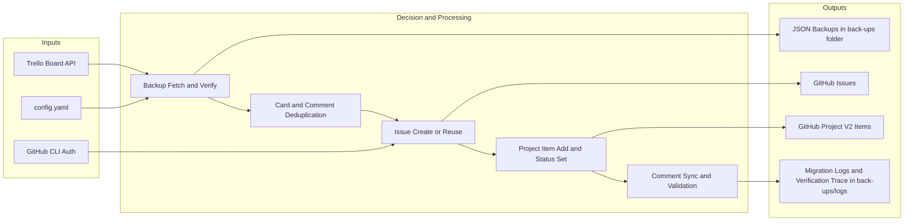
```mermaid
flowchart LR
    subgraph Input[Inputs]
        C1[config.yaml]
        C2[Trello Board API]
        C3[GitHub CLI Auth]
    end

    subgraph Process[Decision and Processing]
        P1[Backup Fetch and Verify]
        P2[Card and Comment Deduplication]
        P3[Issue Create or Reuse]
        P4[Project Item Add and Status Set]
        P5[Comment Sync and Validation]
    end

    subgraph Output[Outputs]
        O1[JSON Backups in back-ups folder]
        O2[GitHub Issues]
        O3[GitHub Project V2 Items]
        O4[Migration Logs and Verification Trace in back-ups/logs]
    end

    C1 --> P1
    C2 --> P1
    C3 --> P3
    P1 --> P2 --> P3 --> P4 --> P5
    P1 --> O1
    P3 --> O2
    P4 --> O3
    P5 --> O4
```

## System Architecture

> [!NOTE]
>
> 1. Use Mermaid diagrams in this note for AI readability purposes.
>
> 2. For publication, put image components in presentation slides directly.

> [!WARNING]
>
> **Draw.io Files Management:**
>
> If diagrams are created with draw.io:
>
> 1. Attach `.drawio` links in this note and relevant docs.
> 2. Store raw `.drawio` files in `./docs/drawio`.
> 3. Export PNG/SVG and embed in documentation.
> 4. Version `.drawio` files.
> 5. Use consistent naming: `<project-name>.drawio`.

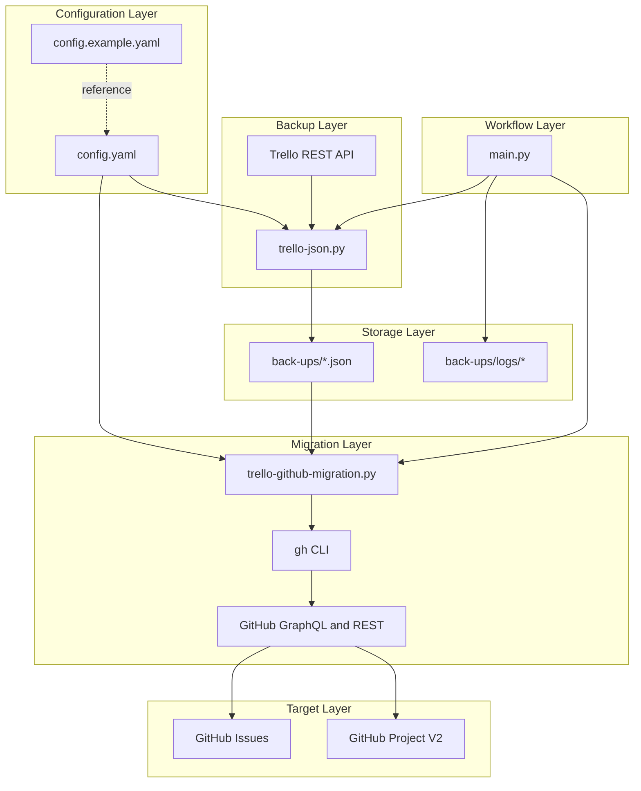
```mermaid
graph TB
    subgraph Config[Configuration Layer]
        CFG[config.yaml]
        EXCFG[config.example.yaml]
    end

    subgraph Backup[Backup Layer]
        TJ[trello-json.py]
        TAPI[Trello REST API]
    end

    subgraph Migration[Migration Layer]
        TM[trello-github-migration.py]
        GHCLI[gh CLI]
        GAPI[GitHub GraphQL and REST]
    end

    subgraph Workflow[Workflow Layer]
        MAIN[main.py]
    end

    subgraph Data[Storage Layer]
        BAK[back-ups/*.json]
        LOGS[back-ups/logs/*]
    end

    subgraph Target[Target Layer]
        GHISS[GitHub Issues]
        GHPROJ[GitHub Project V2]
    end

    CFG --> TJ
    CFG --> TM
    EXCFG -. reference .-> CFG

    TAPI --> TJ
    TJ --> BAK

    BAK --> TM
    GHCLI --> GAPI
    TM --> GHCLI
    GAPI --> GHISS
    GAPI --> GHPROJ

    MAIN --> TJ
    MAIN --> TM
    MAIN --> LOGS
```

### Software Requirements and Versions

| Component | Implementation | Version/Release | Purpose |
| --- | --- | --- | --- |
| Runtime | Python | 3.9+ | Script execution |
| Trello Client | Trello REST API | v1 endpoints | Board/card/comment retrieval |
| GitHub Integration | GitHub CLI (`gh`) | Latest stable | Issues and Projects V2 operations |
| Config Parser | PyYAML | Latest stable | YAML config loading |
| HTTP Client | requests | Latest stable | Trello API calls |
| Data Format | JSON | RFC 8259 | Backup persistence |

### Components Explanation

#### [Configuration Layer - YAML Settings](installation-guide-link)

- `config.yaml` defines Trello credentials, board IDs, target repositories/projects, and rate-limit behavior.
- `config.example.yaml` is the sanitized reference template for new environments.

#### [Backup Layer - Trello API Export](backup-guide-link)

- `trello-json.py` exports full board data and verifies per-card comments.
- Supports force refresh, board filtering, and worker thread control.
- Produces reproducible JSON backups in `back-ups/`.

#### [Migration Layer - GitHub Issues and Projects](migration-guide-link)

- `trello-github-migration.py` loads backup JSON and migrates cards into issues.
- Reuses existing issues by title when detected.
- Adds issues to GitHub Project V2 and sets `Status` to matching Trello list where possible.

#### [Workflow Layer - Main Orchestrator](workflow-guide-link)

- `main.py` executes a default two-step workflow for internship board:
  - Backup refresh and verification.
  - Migration to GitHub.
- Runtime logs and error logs are centralized under `back-ups/logs/`.

#### [Storage Layer - JSON Backups](data-guide-link)

- Board exports are stored with board ID and board name in filename.
- Backup files can be reused for migration reruns and auditing.
- Backup and migration run/error logs are stored in `back-ups/logs/`.
- Current log file names include `backup_run.log`, `backup_run.err`, `backup_full.log`, `backup_full.err`, `migrate_run.log`, `migrate_run.err`, `migrate_full.log`, and `migrate_full.err`.

#### [Target Layer - GitHub Repository and Project V2](target-guide-link)

- Output artifacts include issues, labels (`Trello Import`, `List: ...`), project items, and comment bundles.
- Migration supports partial reruns with duplicate checks.

## Use Case Diagram

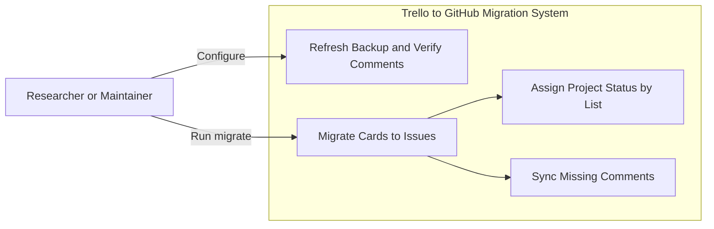
```mermaid
graph LR
    Operator[Researcher or Maintainer]

    subgraph "Trello to GitHub Migration System"
        UC1[Refresh Backup and Verify Comments]
        UC2[Migrate Cards to Issues]
        UC3[Assign Project Status by List]
        UC4[Sync Missing Comments]
    end

    Operator -->|Configure| UC1
    Operator -->|Run migrate| UC2
    UC2 --> UC3
    UC2 --> UC4
```

## Message Sequence Chart (MSC)

### UC1: Refresh Backup with Comment Verification

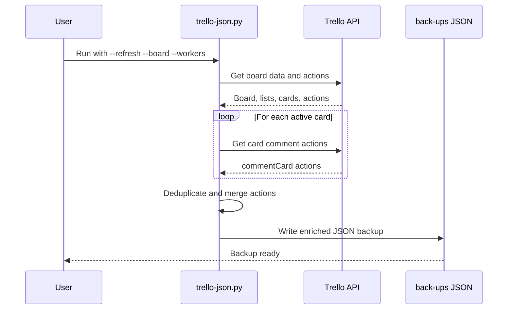
```mermaid
sequenceDiagram
    participant User
    participant BackupScript as trello-json.py
    participant TrelloAPI as Trello API
    participant Storage as back-ups JSON

    User->>BackupScript: Run with --refresh --board --workers
    BackupScript->>TrelloAPI: Get board data and actions
    TrelloAPI-->>BackupScript: Board, lists, cards, actions
    loop For each active card
        BackupScript->>TrelloAPI: Get card comment actions
        TrelloAPI-->>BackupScript: commentCard actions
    end
    BackupScript->>BackupScript: Deduplicate and merge actions
    BackupScript->>Storage: Write enriched JSON backup
    Storage-->>User: Backup ready
```

### UC2: Migrate Cards to GitHub Issues

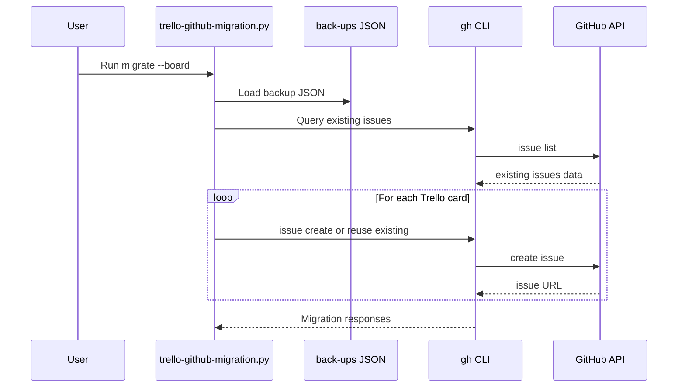
```mermaid
sequenceDiagram
    participant User
    participant MigrationScript as trello-github-migration.py
    participant Backup as back-ups JSON
    participant GH as gh CLI
    participant GitHub as GitHub API

    User->>MigrationScript: Run migrate --board
    MigrationScript->>Backup: Load backup JSON
    MigrationScript->>GH: Query existing issues
    GH->>GitHub: issue list
    GitHub-->>GH: existing issues data
    loop For each Trello card
        MigrationScript->>GH: issue create or reuse existing
        GH->>GitHub: create issue
        GitHub-->>GH: issue URL
    end
    GH-->>MigrationScript: Migration responses
```

### UC3: Add Issues to GitHub Project and Set Status

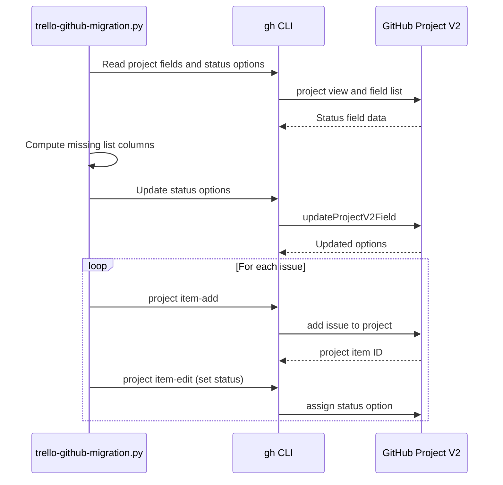
```mermaid
sequenceDiagram
    participant MigrationScript as trello-github-migration.py
    participant GH as gh CLI
    participant GitHub as GitHub Project V2

    MigrationScript->>GH: Read project fields and status options
    GH->>GitHub: project view and field list
    GitHub-->>GH: Status field data
    MigrationScript->>MigrationScript: Compute missing list columns
    MigrationScript->>GH: Update status options
    GH->>GitHub: updateProjectV2Field
    GitHub-->>GH: Updated options

    loop For each issue
        MigrationScript->>GH: project item-add
        GH->>GitHub: add issue to project
        GitHub-->>GH: project item ID
        MigrationScript->>GH: project item-edit (set status)
        GH->>GitHub: assign status option
    end
```

### UC4: Verify and Sync Missing Comments

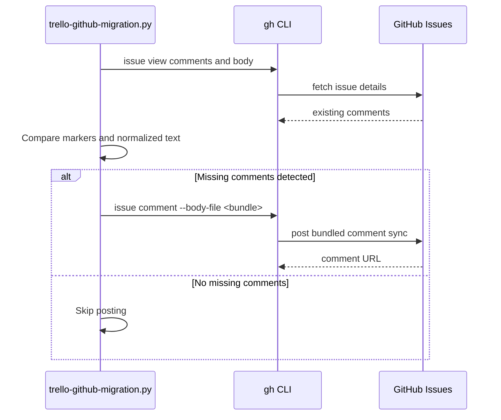
```mermaid
sequenceDiagram
    participant MigrationScript as trello-github-migration.py
    participant GH as gh CLI
    participant GitHub as GitHub Issues

    MigrationScript->>GH: issue view comments and body
    GH->>GitHub: fetch issue details
    GitHub-->>GH: existing comments
    MigrationScript->>MigrationScript: Compare markers and normalized text
    alt Missing comments detected
        MigrationScript->>GH: issue comment --body-file <bundle>
        GH->>GitHub: post bundled comment sync
        GitHub-->>GH: comment URL
    else No missing comments
        MigrationScript->>MigrationScript: Skip posting
    end
```

## Flowchart

### UC1: Backup and Verification Flow

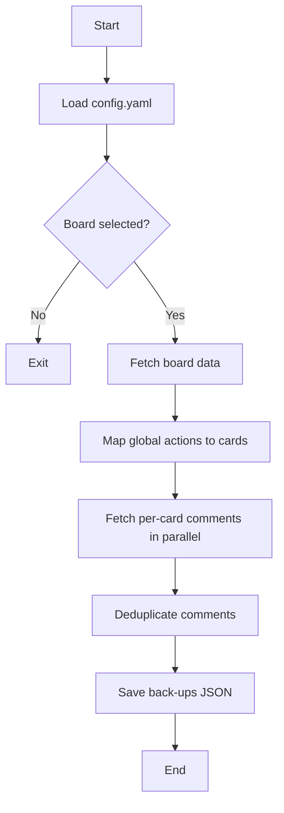
```mermaid
flowchart TD
    A[Start] --> B[Load config.yaml]
    B --> C{Board selected?}
    C -->|No| D[Exit]
    C -->|Yes| E[Fetch board data]
    E --> F[Map global actions to cards]
    F --> G[Fetch per-card comments in parallel]
    G --> H[Deduplicate comments]
    H --> I[Save back-ups JSON]
    I --> J[End]
```

### UC2: Issue Migration Flow

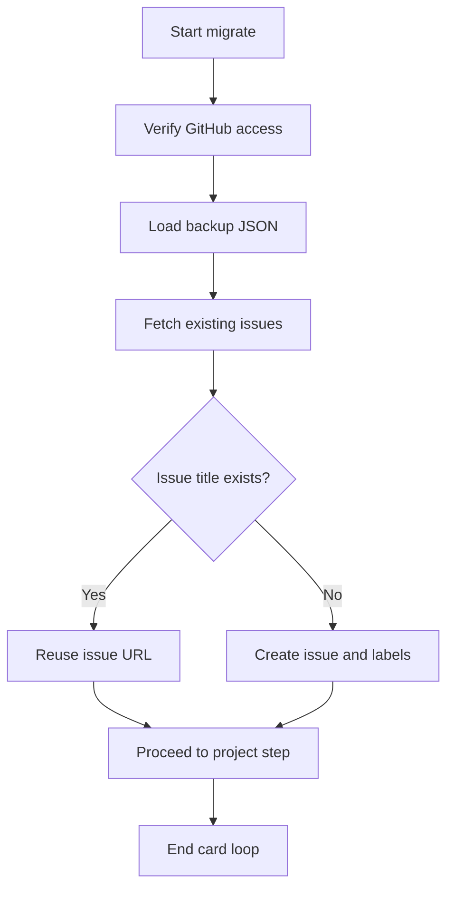
```mermaid
flowchart TD
    A[Start migrate] --> B[Verify GitHub access]
    B --> C[Load backup JSON]
    C --> D[Fetch existing issues]
    D --> E{Issue title exists?}
    E -->|Yes| F[Reuse issue URL]
    E -->|No| G[Create issue and labels]
    F --> H[Proceed to project step]
    G --> H
    H --> I[End card loop]
```

### UC3: Project Item and Status Assignment Flow

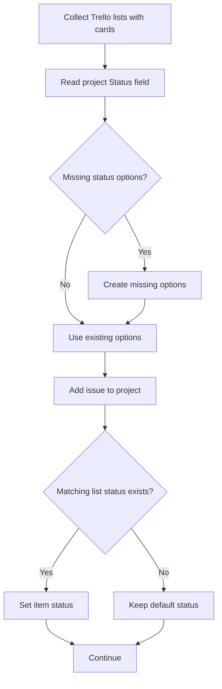
```mermaid
flowchart TD
    A[Collect Trello lists with cards] --> B[Read project Status field]
    B --> C{Missing status options?}
    C -->|Yes| D[Create missing options]
    C -->|No| E[Use existing options]
    D --> E
    E --> F[Add issue to project]
    F --> G{Matching list status exists?}
    G -->|Yes| H[Set item status]
    G -->|No| I[Keep default status]
    H --> J[Continue]
    I --> J
```

### UC4: Comment Sync Flow

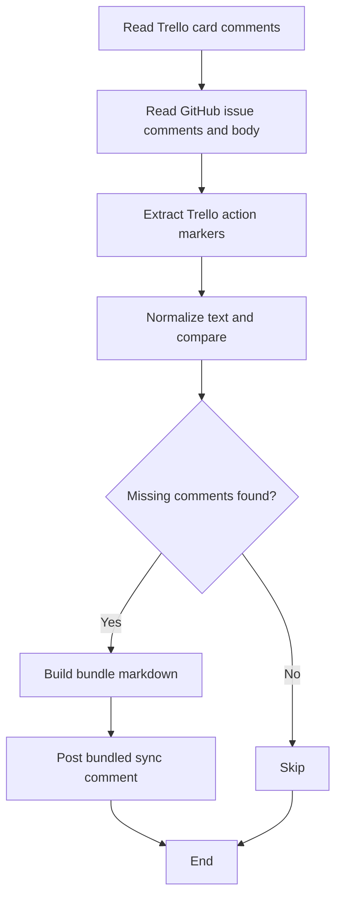
```mermaid
flowchart TD
    A[Read Trello card comments] --> B[Read GitHub issue comments and body]
    B --> C[Extract Trello action markers]
    C --> D[Normalize text and compare]
    D --> E{Missing comments found?}
    E -->|Yes| F[Build bundle markdown]
    F --> G[Post bundled sync comment]
    E -->|No| H[Skip]
    G --> I[End]
    H --> I
```

## Class Diagram

This section defines core software classes used in the migration implementation.

### Source Tree (Production Handover)

```text
src/
    controllers/
        main_application.py
        trello_backup_controller.py
        github_migration_controller.py
    models/
        step_command.py
        trello_client.py
        github_client.py
    views/
        console_view.py
        log_view.py
```

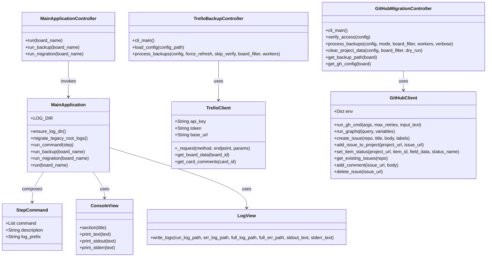
```mermaid
classDiagram
        class MainApplicationController {
                +run(board_name)
                +run_backup(board_name)
                +run_migration(board_name)
        }

    class MainApplication {
        +LOG_DIR
        +ensure_log_dir()
        +migrate_legacy_root_logs()
        +run_command(step)
        +run_backup(board_name)
        +run_migration(board_name)
        +run(board_name)
    }

    class StepCommand {
        +List command
        +String description
        +String log_prefix
    }

    class TrelloBackupController {
        +cli_main()
        +load_config(config_path)
        +process_backups(config, force_refresh, skip_verify, board_filter, workers)
    }

    class TrelloClient {
        +String api_key
        +String token
        +String base_url
        +_request(method, endpoint, params)
        +get_board_data(board_id)
        +get_card_comments(card_id)
    }

    class GitHubMigrationController {
        +cli_main()
        +verify_access(config)
        +process_backups(config, mode, board_filter, workers, verbose)
        +clear_project_data(config, board_filter, dry_run)
        +get_backup_path(board)
        +get_gh_config(board)
    }

    class ConsoleView {
        +section(title)
        +print_text(text)
        +print_stdout(text)
        +print_stderr(text)
    }

    class LogView {
        +write_logs(run_log_path, err_log_path, full_log_path, full_err_path, stdout_text, stderr_text)
    }

    class GitHubClient {
        +Dict env
        +run_gh_cmd(args, max_retries, input_text)
        +run_graphql(query, variables)
        +create_issue(repo, title, body, labels)
        +add_issue_to_project(project_url, issue_url)
        +set_item_status(project_url, item_id, field_data, status_name)
        +get_existing_issues(repo)
        +add_comment(issue_url, body)
        +delete_issue(issue_url)
    }

    MainApplicationController --> MainApplication : invokes
    MainApplication --> StepCommand : composes
    MainApplication --> ConsoleView : uses
    MainApplication --> LogView : uses
    TrelloBackupController --> TrelloClient : uses
    GitHubMigrationController --> GitHubClient : uses
```

### System Parameters

| Category | Parameter | Type | Unit | Description |
| --- | --- | --- | --- | --- |
| Trello Input | `board.id` | String | - | Trello board identifier |
| Trello Input | `card.id` | String | - | Trello card identifier |
| Trello Input | `action.id` | String | - | Trello action/comment identifier |
| Trello Input | `action.data.text` | String | - | Trello comment content |
| Config Input | `tokens.trello.api_key` | String | - | Trello API key |
| Config Input | `tokens.trello.token` | String | - | Trello API token |
| Config Input | `trello_boards[].github.project` | URL | - | GitHub Project V2 URL |
| Config Input | `trello_boards[].github.repo` | URL | - | GitHub repository URL |
| GitHub Output | `issue.title` | String | - | Issue title generated from card name |
| GitHub Output | `issue.body` | String | - | Issue description with import metadata |
| GitHub Output | `label` | String | - | Labels including list category |
| Project Output | `status option` | String | - | Status mapped from Trello list name |
| Sync Output | `TRELLO_ACTION_ID` marker | String | - | Marker used for duplicate-safe comment sync |

## References

[1] Trello, "Trello REST API Introduction," Atlassian Developer Documentation. [Online]. Available: https://developer.atlassian.com/cloud/trello/rest/

[2] GitHub, "GitHub CLI Manual (`gh`)," GitHub Docs. [Online]. Available: https://cli.github.com/manual/

[3] GitHub, "Managing Projects (Project V2)," GitHub Docs. [Online]. Available: https://docs.github.com/issues/planning-and-tracking-with-projects/

[4] YAML, "YAML Ain't Markup Language Specification," [Online]. Available: https://yaml.org/spec/

[5] Python Software Foundation, "Python 3 Documentation," [Online]. Available: https://docs.python.org/3/
