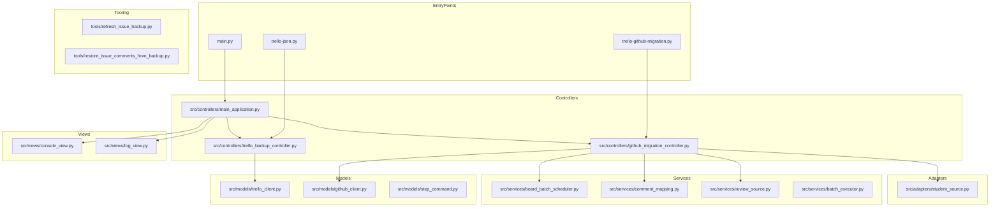
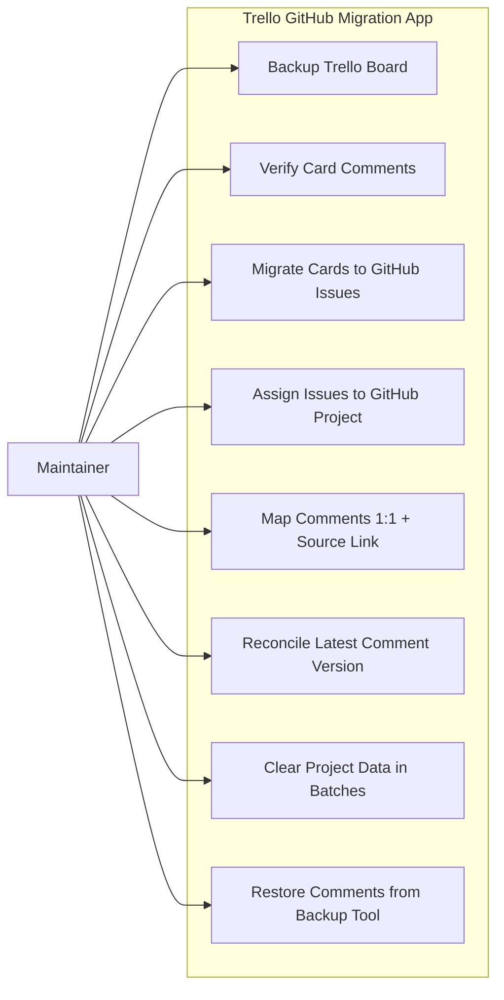
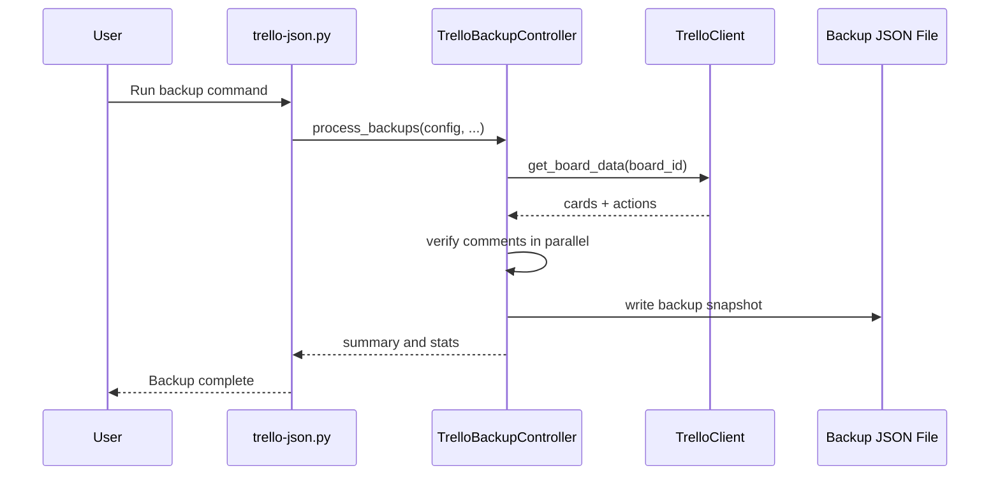
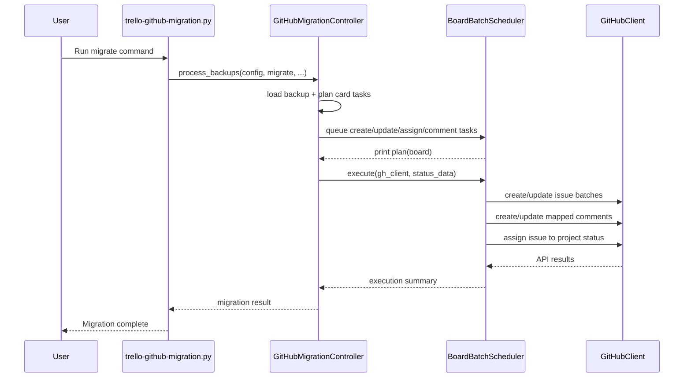
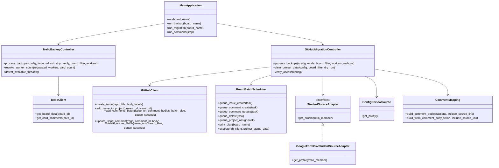
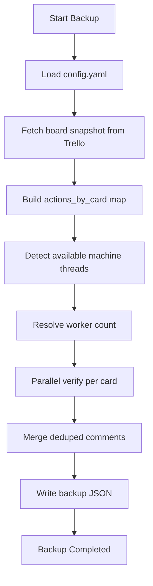
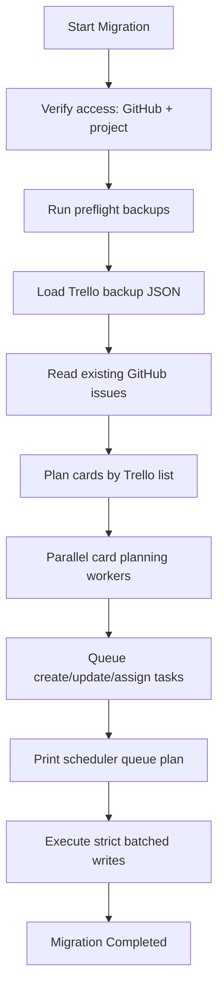
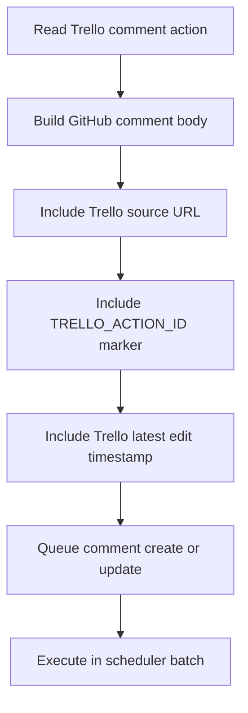
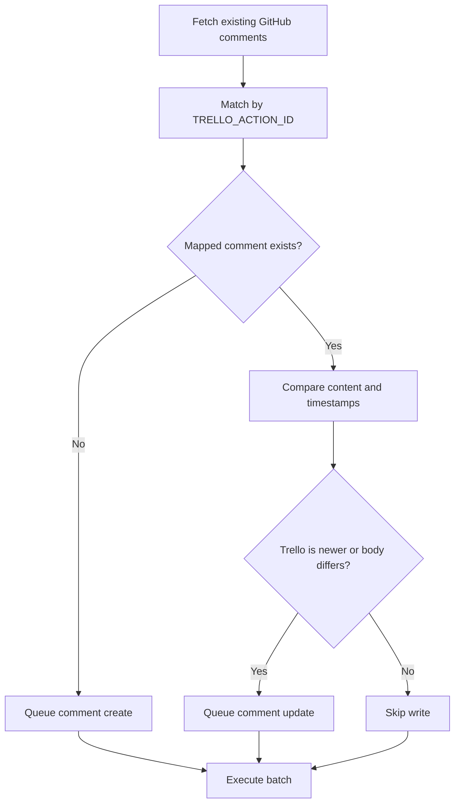
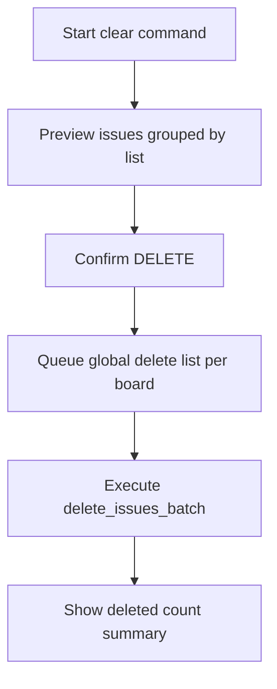

# Developer Guide - Trello GitHub Migration

## Purpose

This guide contains deep technical documentation for maintainers and contributors.

## Table of Contents

- Introduction
- Configuration Guide
- System Structure Diagram
- Use Cases (Features)
- Message Sequence Charts (MSC)
- Class Diagram
- Feature Flowcharts
- Operational Notes
- References

## Introduction

The app is organized as an OOP workflow with controller/model/service/adapter layers.

Primary workflow:

1. Backup from Trello.
2. Verify and deduplicate card comments.
3. Plan migration operations.
4. Queue writes globally per board.
5. Execute API writes in strict batches.

## Configuration Guide

Important config keys:

```yaml
options:
    rate_limit_delay: 2
    github_batch_size: 20
    github_batch_pause_seconds: 1

review:
    name: "Lab SOP"
    root_url: "https://github.com/bmw-ece-ntust/SOP"

students:
    source: "google_form_csv" # or "none"
    google_form_csv_url: "https://docs.google.com/spreadsheets/d/<sheet-id>/export?format=csv"
```

## System Structure Diagram



## Use Cases (Features)



## Message Sequence Charts (MSC)

### MSC 1: Trello Backup and Verification



### MSC 2: Migration and Comment Reconciliation



## Class Diagram



## Feature Flowcharts

### Feature 1: Trello Backup and Verification



### Feature 2: Card Migration to GitHub



### Feature 3: 1:1 Comment Mapping with Source Link



### Feature 4: Latest Comment Reconciliation



### Feature 5: Cleanup (Clear) in Batches



## Operational Notes

- GitHub cannot impersonate arbitrary student accounts unless actions run under their credentials.
- The app supports attribution metadata and source-link mapping.
- For mapped comments, the latest Trello-backed version is preferred during reconciliation.
- Scheduler queues writes per board and executes them in strict phases to reduce API pressure.

## References

- [SOP Project Documentation Template](https://github.com/bmw-ece-ntust/SOP/blob/master/project-documentation.md)
- [Refactoring.Guru Design Patterns](https://refactoring.guru/design-patterns)
- [GitHub CLI Manual](https://cli.github.com/manual/)
- [Trello REST API](https://developer.atlassian.com/cloud/trello/rest/)
