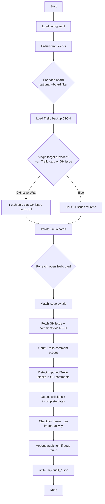

# Feature: Audit (`trello-github-migration.py audit`)

## Purpose

Compares Trello backup data vs GitHub Issues and writes a JSON “audit report” listing issues that need attention.

This is designed to detect and repair:

- missing imported Trello comments
- “collided” comments where multiple Trello blocks were batched into one GitHub comment
- incomplete/legacy date formatting
- protection cases where GitHub has newer non-import user comments (so sync should be conservative)

## CLI

```bash
# audit all boards
python trello-github-migration.py audit

# audit a specific board
python trello-github-migration.py audit --board "internship"

# audit a single Trello card URL/shortLink OR a single GitHub issue URL
python trello-github-migration.py audit --url "https://trello.com/c/naadMEL4"
python trello-github-migration.py audit --url "naadMEL4"
python trello-github-migration.py audit --url "https://github.com/org/repo/issues/379"

# tune 'active on Trello' lookback window
python trello-github-migration.py audit --active-days 90
```

## Inputs

- Trello backups in `back-ups/` (must exist; run `trello-json.py` first)
- GitHub issues + comments (via `gh api` REST endpoints)

## Outputs

- Audit JSON written to `tmp/` with pattern:
  - `tmp/audit_<board or all>_<timestamp>.json`

The report includes `items[]` describing what is wrong and what is safe to sync.

## Main logic

1. Create `tmp/` if needed.
2. For each board (optional filter):
   - load Trello backup
   - list GitHub issues (or, for a single issue URL, fetch just that issue)
3. For each non-closed Trello card:
   - find the matching GitHub issue (by title)
   - fetch GitHub issue + comments
   - compute Trello comment count and imported-comment-block count in GitHub
   - detect:
     - `missing_comments`
     - `collided_batched_comments`
     - `incomplete_dates`
   - determine whether it is `safe_to_sync`:
     - if there are non-import GitHub comments created after Trello’s last activity, mark as unsafe
4. Write report JSON and print summary.

## Flowchart



## Notes / gotchas

- Matching is by title; if titles drift, audit may not find the corresponding issue.
- The tool intentionally avoids destructive actions; it only reports.
- `safe_to_sync` is a guardrail: if GitHub users have commented after Trello’s last activity, sync should not delete/rebuild comments.
