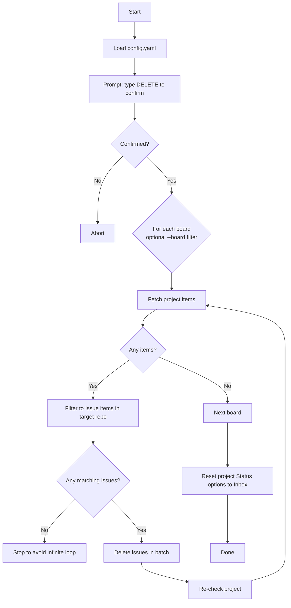

# Feature: Clear project data (`trello-github-migration.py clear`)

## Purpose

Deletes GitHub Issues linked to the configured GitHub Project(s) and resets project Status columns.

This is meant for cleanup after a failed migration run.

## CLI

```bash
python trello-github-migration.py clear

# clear only a specific board by name substring
python trello-github-migration.py clear --board "internship"
```

## Inputs

- `config.yaml` with `trello_boards[]` GitHub project + repo targets
- GitHub permissions: needs ability to delete issues + modify project fields

## Outputs

- Issues removed from the project (deleted in batches)
- Project Status field options reset to a single `Inbox` option

## Main logic

1. Prompt for confirmation (`Type 'DELETE' to confirm`).
2. For each board (optional filter):
   - iterate project items in batches
   - keep only items that are Issues and belong to the target repo
   - delete issues in batch (GraphQL)
3. Reset project Status options to `Inbox`.

## Flowchart



## Notes / gotchas

- This is destructive and cannot be undone.
- The script includes a safety stop to avoid infinite loops when a batch contains only external items.
