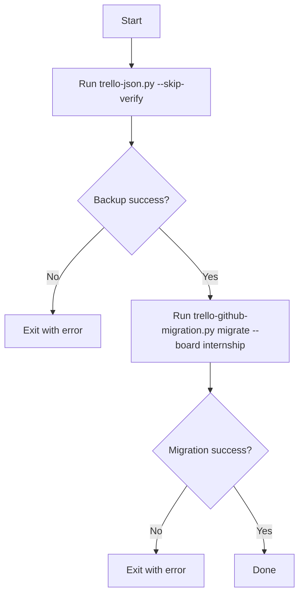

# Scripted workflow (`main.py`)

## Purpose

Runs the migration as a two-step workflow:

1. Trello backup (`trello-json.py`)
2. GitHub migration (`trello-github-migration.py migrate --board <name>`)

This is a convenience runner; it’s not as configurable as calling the CLIs directly.

## CLI

```bash
python main.py
```

## Main logic

- Uses `sys.executable` to run the same Python interpreter for subprocess commands.
- Executes:
  - `python trello-json.py --skip-verify`
  - `python trello-github-migration.py migrate --board internship`

## Flowchart



## Notes

- Edit `main.py` if you want to target a different board.
- For full control, prefer calling `trello-json.py` and `trello-github-migration.py` directly.
